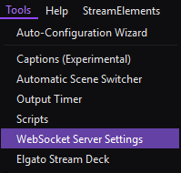
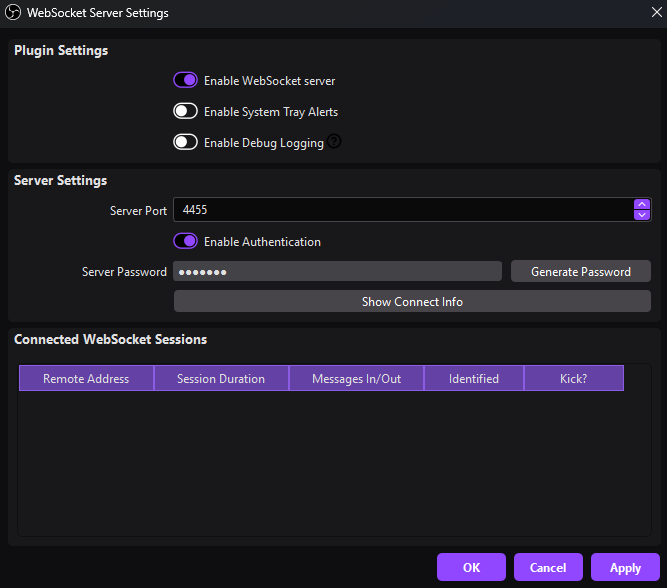
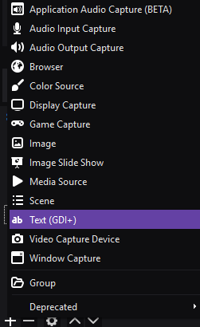
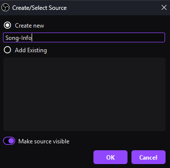
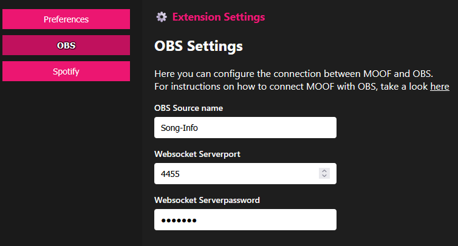
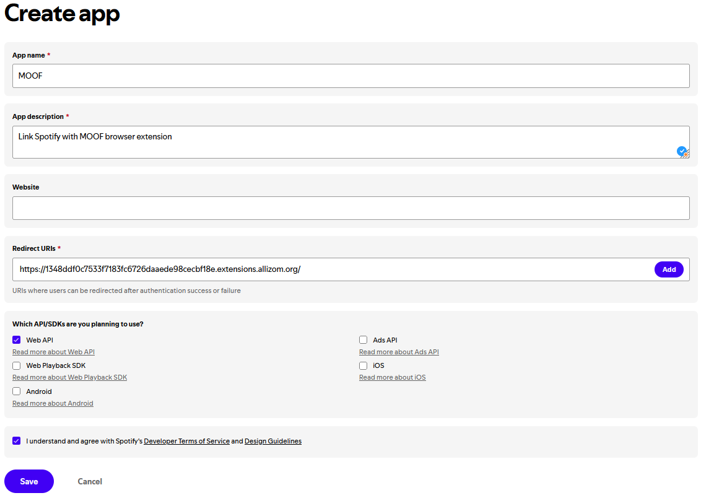
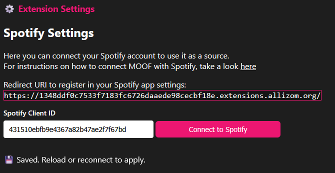
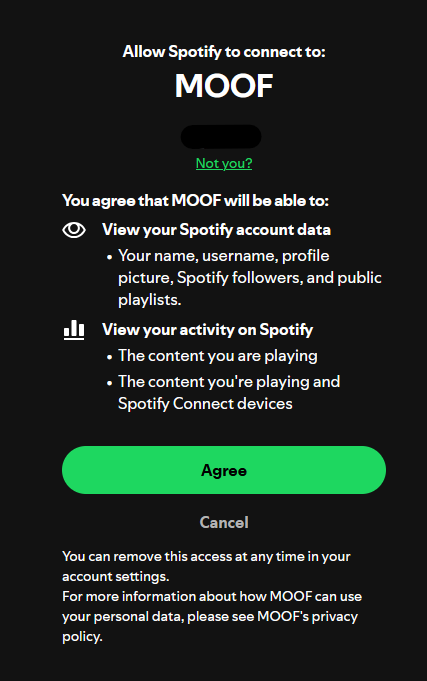

# Music on OBS Firefox (MOOF)

**MOOF** is a Firefox browser extension that captures the currently playing song title from sources like YouTube and Spotify and sends it in real-time via WebSocket for display in OBS.

---

## Features

- Automatically extracts song titles from active tabs (e.g., YouTube, Spotify)
- Sends song information in real time via WebSocket to OBS
- Lightweight, minimal, and runs quietly in the background
- Non-intrusive — doesn’t interfere with your browsing experience
- **100% local — your data never leaves your machine**

---

## Installation & Setup

1. Install the extension from the Firefox Add-ons Store or load it temporarily via `about:debugging`.

2. In OBS, go to `Tools -> WebSocket Server Settings`.

    

3. Configure the WebSocket server:

    - Enable **WebSocket server**
    - (Optional) Choose a custom server port
    - Enable **Authentication**
    - Set a **server password** (at least 6 characters)

    

4. In OBS, create a new text source (`Text (GDI+)`).

    

    

5. Open MOOF and go to `Settings -> OBS`.

6. Enter the **exact name** of the text source you created in OBS (case-sensitive).

7. Enter the WebSocket **server port** and **password** from OBS.

    

MOOF is now connected to OBS and ready to display music titles.

---

## Connect Spotify

1. In MOOF, go to `Settings -> Spotify`.

2. Copy the displayed **Redirect URI**.

3. Visit the [Spotify Developer Dashboard](https://developer.spotify.com/dashboard) and create a new app.

4. Click **Create App** and enter the following:

    - **App name**: `MOOF`
    - **App description**: `Link Spotify with MOOF browser extension`
    - **Redirect URIs**: Paste the copied URI
    - **Web API**: Check this option

    

5. Copy the **Client ID** and paste it into MOOF's Spotify settings.

    

6. Click **Connect to Spotify** and approve the connection.

    > **Note**: MOOF only requests the minimum permissions required.  
    > It can access the currently playing track and playback status (paused or playing).  
    > No personal account data is accessed, stored, or processed.

    

Spotify is now successfully connected to MOOF.

---

## Contributing

Contributions and suggestions are welcome.  
Feel free to open issues or submit pull requests.
